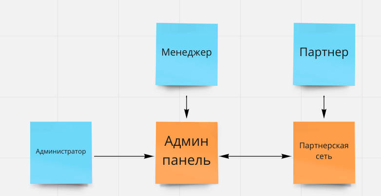
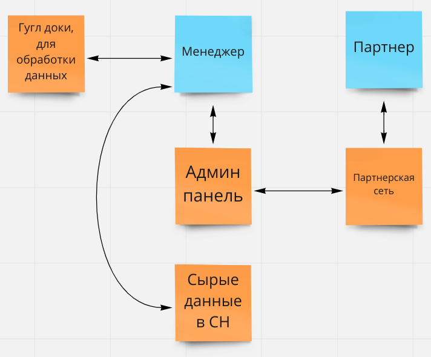
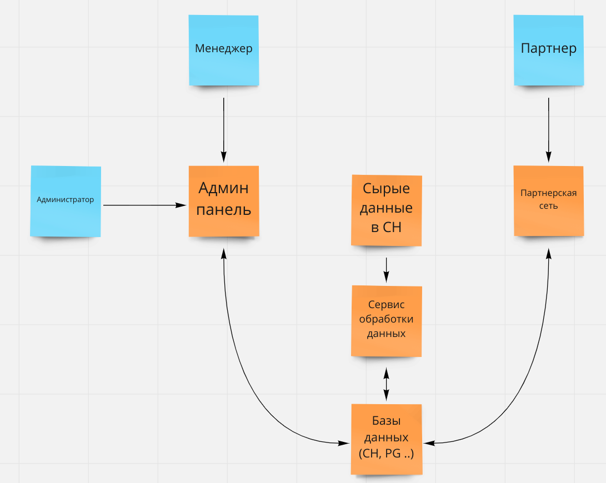

# **Анализ требований и подготовка архитектурному решению**
___
## Бизнес-кейс

Довольно крупная всемирная RevShare партнерка (RSCompany - заказчик) присоединилась к CPA платформе (CPACompany - исполнители).
Т.к. у заказчика нет команды разработки текущая система RSCompany взята в аренду и имеет довольно скудный функционал и визуал. В неё привлекаются партнеры, которые льют трафик только на прямые ссылки. Составлением баннеров/лендов и другим занимаются сами партнеры. К партнеру может прикрепляться менеджер, для помощи в работе (настройки постбеков/выплат).

Для анализа данных о прибыльности системы менеджерам был выдан доступ к некоторым таблицам в БД. Из-за того что данные хранятся и в БД и в текущей админке производится очень много манки-джоба.

Заказчик хочет перейти в нашу систему с доработкой функционала. Это позволит быстрее расширяться и увеличить свой доход.

### Бизнес-драйверы

- Нехватка функционала, из-за чего партнеры могут уходить в другие системы
- Нет хорошей статистики как для менеджеров, так и для партнеров
- Нет удобного апрува трафика по отчетам, и ролевой системы юзеров
- Фронт текущий системы выглядит недостаточно красиво, чтобы привлекать много внешних партнеров

### Бизнес-цели

Компания устанавливает следующую бизнес-цель, чтобы помочь ситуации:
- Сделать полный перенос системы в другую партнерскую сеть, которая будет удовлетворять требуемым качествам.

___
# Стейкхолдеры

- Администратор
- Менеджеры разных уровней
- Партнер
- Команда разработки

___
# Приоритетные сценарии

- UC-1 Оценка качества
1. Менеджер выгружает отчет
2. Происходит автопроставление статусов по условиям
3. Менеджер ставит статусы, там где их нет
4. Выгрузка в сводную таблицу, которая идет на апрув по цепочке (Account Manager Approve -> RISK Manager approve -> Head approve)
5. На основе заапрувленных данных формируется отчет партнеру

- UC-2 Менеджер сапортит партнера
1. Партнер оставляет тикет
2. Менеджер отвечает
3. Переписка продолжается пока вопрос не решен

- UC-3 Настройка кампаний партнером
1. Партнер выбирает из списка офферов нужный по фильтрам
2. Выбирает доступную комиссию
3. Выбирает ленды/промо
4. Настраивает постбеки
5. Получает ссылку

- UС-4 Выплата партнерам
1. Партнер добавляем кошелек
2. Запрашивает выплату
3. Выплата проверяется менеджером, после апрувится или реджектится.

- UC-5 Антифрод
- UC-6 Получение общей статистики партнером

___
# Базовые атрибуты качества

- Быстрое формирование ответов с учетом фильтрации
- Безошибочное отображение статистики (как в админке, так и у партнера)
- Удобный интерфейс партнера
- Хорошая система антифрода

___
# Бизнес контекст

___
# Текущая архитектура

___

# Критические сценарии

- UC-1 - оптимизация работы менеджера
- UC-3 - настройка основных параметров партнером
- UС-4 - вывод средств

# Критичные характеристики

- Время разработки
- Точность обработки данных (формулы, а не частота обновления)
- Удобство интерфейса

# Архитектурное решение 0

**Контекст:**

Текущая система работает плохо. Из-за манки-джоба на задачи менеджером тратится много времени. Так же возможны ошибки (человеческий фактор).
Первично заказчик хочет видеть оптимизацию UC-1

**Альтернативы:**

- Альтернатива 0. Оставить все как есть и ничего не делать
- Альтернатива 1. Разработать полноценную систему по ТЗ и перенести все данные из старой системы
- Альтернатива 2. Оптимизировать UC-1, преобразовав сырые данные
- Альтернатива 3. Оптимизировать UC-1, используя сырые данные

**Оценка и сравнительный анализ**

Показатель | А0 | А1 | А2 | А3 
---|---|---|---|---|
Время разработки | 0 | ↑↑↑↑↑ | ↑↑ | ↑
Точность данных | 0  | ↑↑ | ↑↑ | ↑↑
Удобство интерфейса | 0 | ↑↑↑ | ↑↑| ↑↑
Расширяемость | 0 | ↑↑ | ↑ | ↓

А0 не устраивает заказчика. 

Хотя А1 и выигрывает по интерфейсу и расширяемости, она проигрывает по скорости разработки. Кроме того не будет виден промежуточный результат, а значит велик риск, что в итоге нужно будет переделывать ряд модулей, которые в свою очередь будут уже завязаны на другой логике.

А2 по времени разработки займет больше времени, чем А3. Однако в дальнейшем код написанный с помощью А3 будет не пригоден для дальнейшего использования.
В А2 написанные наработки можно будет расширять до полноценной системы.

**Решение**

Была выбрана А2:

**Риски:**
- Открытый вопрос отображение статистики партнеру

# Архитектурное решение 1.

**Контекст:**

Т.к. в прошлом решении выло выбрано по частям переносить систему, начиная с оптимизации работы менеджера, нужно решить как будет выводиться статистика партнеру.
На данный момент партнеры используют чужую партнерскую систему, к которой у нас нет доступа.

**Альтернативы:**

- Альтернатива 0. Оставить все как есть и ничего не делать
- Альтернатива 1. Настроить интеграцию с текущий партнерской системой и передавать нужные данные
- Альтернатива 2. Отображать данные в своей партерской системе и дать доступ партнеру ко второму кабинету
- Альтернатива 3. Настроить редирект (и авторизацию) партнера в нашу систему напрямую из его текущей системы

**Оценка и сравнительный анализ**

К сожалению, пока что недостаточно данных об интеграции с текущей партнеркой, т.к. ожидаем данные от их разработчика.
Однако самый реалистичный и быстрый вариант это А3.