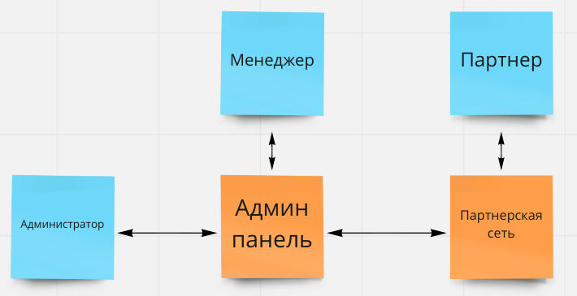
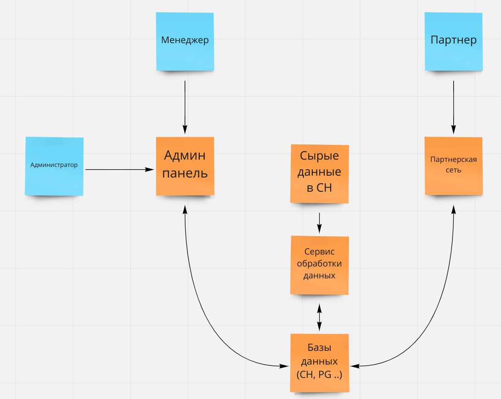
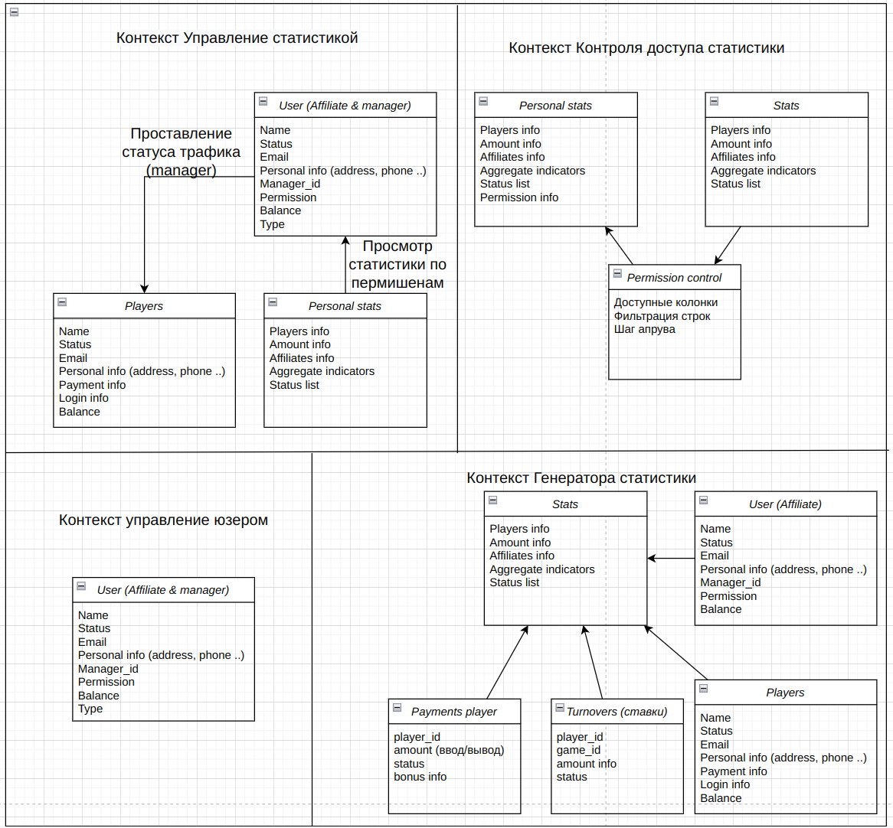
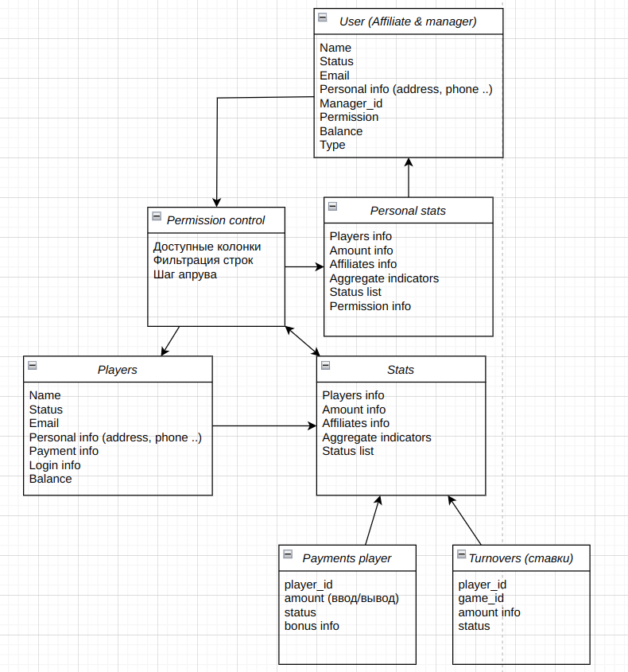

# Адаптация CPA-движка под модель оплаты RevShare 

## Contents
- [Анализ требований и подготовка архитектурному решению](#main_analytic)
  - [Бизнес-кейс](#cases)  
  - [Бизнес-драйверы](#drivers)  
  - [Бизнес-цели](#goals)
  - [Стейкхолдеры](#stakeholders)
  - [Приоритетные сценарии](#priority_scenarios)
  - [Базовые атрибуты качества](#basic_quality_attributes)
  - [Текущая архитектура](#current_architecture)
- [Бизнес контекст](#business_context)
- [Критичные сценарии](#critical_scenarios)
- [Критичные характеристики](#critical_characteristics)
- [Описание предметной области](#description_of_the_subject_area)
- [Диаграмма контейнеров и развёртывания](#diagram_of_containers_and_deployment)
- [Оценка решения](#decision_evaluation)
  - [Диаграмма последовательности](#sequence_diagram)
  - [Оценка атрибутов качества](#assessment_of_quality_characteristics)

___
- [Модели предметной области](#domain_models)
- [Архитектурное решение 0](#architectural_solution_0)
  - [Модели предметной области блока "Оценка качества"](#domain_models_quality_control)
    - [Функциональная декомпозиция](#functional_decomposition)
    - [Сценарии изменений](#change_scenarios)
    - [Оценка модифицируемости](#modifiability_assessment)
    - [Сравнительный анализ](#comparative_analysis)
- [Описание сервисов](#description_of_services)
  - [Сервис "Web Application Admin/Partner"](#service_web)
  - [Сервис "Admin service"](#admin_service)
  - [Сервис "Partner service"](#partner_service)
  - [Модуль "Блок обработки пермишенов"](#service_perm)
  - [Модуль "Генерация статистики"](#service_stat)
  - [Модуль "Изменение статуса конверсии"](#service_stat_edit)
  - [Сервис "FSWatcher"](#service_fswatcher)
  - [Крон "Импорт данных игроков](#service_import_data)
  - [Крон "Генерация отчетов"](#service_cron)
 

# **Анализ требований и подготовка архитектурного решения** 
___
## Бизнес-кейс 

У нашей компании есть партнерская сеть работающая только по модели CPA (Cost Per Action). Мы соединяем рекламодателей и вебмастеров(партнеров), которые могут размещать рекламу на различных площадках. 
Довольно крупная международная RevShare партнерка (заказчик) присоединилась к нам.
Т.к. у заказчика нет команды разработки текущая система заказчика взята в аренду и имеет довольно скудный функционал и визуал. В неё привлекаются партнеры, которые льют трафик только на прямые ссылки(редирект напрямую к рекломадателю). Составлением баннеров/лендов и другим занимаются сами партнеры. К партнеру может прикрепляться менеджер, для помощи в работе (настройки постбеков/выплат).

Для анализа данных о прибыльности системы менеджерам был выдан доступ к некоторым таблицам в БД. Из-за того, что не все данные отображаются в админке менеджерам приходится самостоятельно подключаться к базе данных, производится очень много манки-джоба.

Заказчик хочет перейти в нашу систему с доработкой функционала. Это позволит быстрее расширяться и увеличить свой доход.

## Бизнес-драйверы 

- Нехватка функционала, из-за чего партнеры могут уходить в другие системы
- Нет хорошей статистики как для менеджеров, так и для партнеров
- Нет удобного аппрува трафика по отчетам, и ролевой системы юзеров
- Фронт текущий системы выглядит недостаточно удобно и красиво, чтобы привлекать много внешних партнеров

## Бизнес-цели 

Компания устанавливает следующую бизнес-цель, чтобы помочь ситуации:
- Сделать полный перенос системы в другую партнерскую сеть, которая будет удовлетворять требуемым качествам.

___

## Стейкхолдеры 

- Администратор
- Менеджеры разных уровней
- Партнер
- Команда разработки

___

## Приоритетные сценарии 

- UC-1 Менеджер оценивает качество трафика
1. Менеджер запрашивает статистику
2. Менеджер ставит статусы конверсиям и подтверждает
3. Происходит выгрузка в сводную таблицу, которая идет на аппрув по цепочке (Account Manager Approve -> RISK Manager approve -> Head approve)
4. На основе зааппрувленных данных формируется отчет партнеру

- UC-2 Менеджер сапортит партнера
1. Партнер оставляет тикет
2. Менеджер отвечает
3. Переписка продолжается пока вопрос не решен

- UC-3 Настройка кампаний партнером
1. Партнер выбирает из списка офферов нужный по фильтрам
2. Выбирает доступную комиссию
3. Выбирает ленды/промо
4. Настраивает постбеки
5. Получает ссылку

- UС-4 Выплата партнерам
1. Раз в месяц происходит пересчет средств
2. Юзеру выводится сколько средств он заработал
3. Запрашивает выплату
4. Выплата проверяется менеджером, после аппрувится или реджектится.

- UC-5 Получение общей статистики партнером
1. Юзер заходит в статистику
2. Настраивает фильтры и колонки
3. Получает результат
___

## Базовые атрибуты качества 

- Быстрое формирование ответов с учетом фильтрации
- Безошибочное отображение статистики (как в админке, так и у партнера)
- Удобный интерфейс партнера (настройка кампаний, выплат, статистики...)

**Технические ограничения:**
- Текущая БД хранится на недостаточно мощном сервисе, парсинг данных займет много времени (~3 недели)

**Бизнес-ограничения:**
- На старт MVP закладывается ~3 месяца.

Application sizing (система заказчика / текущая система исполнителя):
1. Кол-во пользователей: ~500 / ~150 000
2. Кол-во кликов: ~5 RPS / ~100 RPS
3. Кол-во игроков: ~100 000 / -
4. Кол-во действий игроков: ~2 RPS / -
___

## Текущая архитектура 

___

# Бизнес контекст 

___

# Критические сценарии 

- UC-1 - Менеджер оценивает качество трафика
- UC-3 - Настройка кампаний партнером
- UС-4 - Выплата партнерам

# Критичные характеристики 

- Время разработки
- Точность обработки данных (формулы, а не частота обновления)
- Удобство интерфейса
- Скорость обработки запросов

___

# Описание предметной области

Так как у нас имеется уже рабочая система, которая частично удовлетворяет заказчика, то дальнейшие схемы будут основываться на ней.
UC-2, UC-3 и UC-5 не будут приняты во внимание, т.к. реализация данного функционала в системе устраивает заказчика. Улучшение данных кейсов будет обсуждаться после доработки критически необходимого функционала
Так же UC-1 частично решает проблемы UC-4, и он вызывает самое большое количество манки-джоба и могут появляться ошибки из-за человеческого фактора, поэтому было решено приоритетно реализовать решение UC-1.

# Диаграмма контейнеров и развёртывания 

Стек технологий:
- Backend - Python 3.10
- Frontend - Angular 13
- Базы данных - PostgreSQL, ClickHouse, MongoDB, Redis

# Оценка решения

Для оценки решения будет использоваться UC-1 (Менеджер оценивает качество трафика)

## Диаграмма последовательности

## Оценка атрибутов качества

### Функциональное качество
**Проектные характеристики** 

- Стоимость изменений  
CAPEX = Стоимость разработки+стоимость инфраструктуры+стоимость трафика для тестирования гипотез 
OPEX = Стоимость поддержки

- Скорость изменений
t(подготовки парсера) + (t(парсинга данных) || t(реализации статистики))

### Производительность

**Время ответа** 
Latency для клиента = t(Блок обработки пермишенов) + t(Генерация статистики) + (t(PostgreSQL) || t(ClickHouse) || t(MongoDB))

**Пропускная способность** 
RPS = min(RPS(Блок обработки пермишенов), RPS(Генерация статистики), (RPS(PostgreSQL) || RPS(ClickHouse) || RPS(MongoDB))

### Модифицируемость
Сценарии возможных изменений:
- Добавление комментария при проставление статуса менеджером 
Стоимость изменений = C(Генерация статистики) + C(Изменение статуса конверсии) + C(модель данных PostgreSQL)

- Добавление новых колонок в статистику 
Стоимость изменений = C(Блок обработки пермишенов) + C(Генерация статистики) + C(модель данных PostgreSQL)

- Изменение зоны видимости статистики у юзеров 
Стоимость изменений = C(Блок обработки пермишенов)

### Отказоустойчивость
**Сценарии сбоев на уровне сервисов**
- Падение блока обработки пермишенов, генерации статистики или любая из БД 
Последствия: пользователь не сможет получить данные, но увидит уведомление о технических работах
- Падение балансировщика или Web App 
Последствия: у пользователя не загрузится приложения (ошибка cloudflare или сервера)
- Сгорает диск на админской ноде 
Последствия: какое-то время не будут работать кабинеты админа и партнера, пока не починят поломку. Не критично
- Сгорает диск на сервисной ноде 
Настроен сервис по бекапам, так же всегда имеется резервная нода. В случае любого отказа на сервисной ноде, происходит переключение на другую. Время отключение сервиса не значительное.

Последствия не критичны, т.к. круглосуточно дежурит служба поддержки и оперативно исправляет падения

**Сценарии инцидентов**
- Увеличилось время ответа на запрос клиента 
MTTR = t(поиск ошибки) + t(исправления) + t(тестирования)

- Кратное увеличение нагрузки на все приложение в результате инцидента 
В приложении настроены алерты, которые заранее предупредят, если загрузка сервера приблизится к критическим

- Увеличение нагрузки в результате DDOS-а 
Последствия: Увеличенное время ответа или падение сервиса до настройки дополнительных правил

### Масштабируемость
- Сценарий роста нагрузки 
Об увеличении нагрузки команда разработки узнает заранее и добавляет ресурсов

- Сценарий роста объема данных 
Мгновенного увелечения случится не может, настроено автоматическое накидывания памяти, в случае если кончается память

- Стоимость масштабирования 
Включена в текущую стоимость, в случае резкого роста неспешно будут докупаться сервера

___
___
___

# Модели предметной области 

# Архитектурное решение 0 

## Контекст:

Текущая система работает плохо. Из-за манки-джоба на задачи менеджером тратится много времени. Так же возможны ошибки (человеческий фактор).
Первично заказчик хочет видеть реализацию UC-1

## Альтернативы:

- Альтернатива 0. Оставить все как есть и ничего не делать
- Альтернатива 1. Разработать полноценную систему по ТЗ и перенести все данные из старой системы
- Альтернатива 2. Реализовать UC-1, преобразовав сырые данные
- Альтернатива 3. Реализовать UC-1, используя сырые данные

## Оценка и сравнительный анализ

Показатель | А0 | А1 | А2 | А3 
---|---|---|---|---|
Время разработки | 0 | ↑↑↑↑↑ | ↑↑ | ↑
Точность данных | 0  | ↑↑ | ↑↑ | ↑↑
Удобство интерфейса | 0 | ↑↑↑ | ↑↑| ↑↑
Расширяемость | 0 | ↑↑ | ↑ | ↓

А0 не устраивает заказчика. 

Хотя А1 и выигрывает по интерфейсу и расширяемости, она проигрывает по скорости разработки. Кроме того не будет виден промежуточный результат, а значит велик риск, что в итоге нужно будет переделывать ряд модулей, которые в свою очередь будут уже завязаны на другой логике.

В А2 написанные наработки можно будет расширять до полноценной системы.
А2 по времени разработки займет больше времени, чем А3. Однако в дальнейшем код, написанный с помощью А3, будет не пригоден для дальнейшего использования. Также используя А3 будут большие задержки.

## Решение

Была выбрана А2:

## Модели предметной области блока "Оценка качества трафика" 

### Функциональная декомпозиция 

**Решение 1**

**Решение 2**

### Сценарии изменений 
1. Добавление комментария при проставлении статуса менеджером (90%)
2. Добавление новых колонок в статистику (80%)
3. Обновление модели данных пользователя (80%)
4. Обновление модели данных менеджера (40%)
5. Увеличение цепочки аппрува менеджерами (55%)
6. Изменение зоны видимости статистики у юзеров (70%)
7. Изменение зоны видимости статистики у менеджеров (70%)
8. Расширение функционала по дальнейшим архитектурным решениям (100%)

### Оценка модифицируемости 

**Решение 1**
1. Добавление комментария при проставлении статуса менеджером (90%)
- C(менеджер), С(очередь аппрува)
2. Добавление новых колонок в статистику (80%)
- С(генератор статы) + (С(менеджер), С(партнер))
3. Обновление модели данных пользователя (80%)
- С(партнер) ± C(генератор статы)
4. Обновление модели данных менеджера (40%)
- C(менеджер)
5. Увеличение цепочки аппрува менеджерами (55%)
- С(очередь аппрува)
6. Изменение зоны видимости статистики у юзеров (70%)
- С(партнер)
7. Изменение зоны видимости статистики у менеджеров (70%)
- С(менеджер)
8. Расширение функционала по дальнейшим архитектурным решениям (100%)
- С(генератор статы) + С(менеджер) + С(партнер)

**Решение 2**
1. Добавление комментария при проставлении статуса менеджером (90%)
- С(управление статистикой)
2. Добавление новых колонок в статистику (80%)
- С(генератор статы) + С(контроль доступа)
3. Обновление модели данных пользователя (80%)
- С(управление юзером)
4. Обновление модели данных менеджера (40%)
- С(управление юзером)
5. Увеличение цепочки аппрува менеджерами (55%)
- С(контроль доступа)
6. Изменение зоны видимости статистики у юзеров (70%)
- С(контроль доступа)
7. Изменение зоны видимости статистики у менеджеров (70%)
- С(контроль доступа)
8. Расширение функционала по дальнейшим архитектурным решениям (100%)
- С(генератор статы) + С(контроль доступа), С(управление юзером)

### Сравнительный анализ 

- В Р2 юзеры(менеджеры, партнеры) объединены в общую сущность, из-за этого не будет дублирующего кода, как в модели юзеров, так и при загрузке статистики
- В Р1 контексты больше разделены по логике, а значит упростит читабельность кода
- В Р1 есть отдельная очередь, для аппрува трафика. В Р2 - реализуется на пермишенах и информации об уже пройденных этапах, которые хранятся непосредственно в модели игроков. Р2 позволит более гибко менять цепочку аппрува.
- Р2 затрагивает меньше контекстов в наиболее вероятных сценариях изменений
- При дальнейшей расширяемости возможностей системы Р2 затронет меньше контекстов

Для данной задачи лучше использовать **Решение 2**. Общая схема модели предметной области:

# Описание сервисов 

## Сервис "Web Application Admin/Partner"

**Запросы:**

• Инициирует просмотр статистики 
• Инициирует изменение статуса конверсии

**Команды:**

• -

**События:**

• -

**Зависимости:** 

• Ожидает запросы от пользователей

## Сервис "Admin service"
- Модуль "Блок обработки пермишенов"
- Модуль "Генерация статистики"
- Модуль "Обработчик запросов PostgreSQL"
- Модуль "Изменение статуса конверсии"

## Сервис "Partner service"
- Модуль "Блок обработки пермишенов"
- Модуль "Генерация статистики"
- Модуль "Обработчик запросов PostgreSQL"

## Модуль "Блок обработки пермишенов"

**Запросы:**

• Просмотр пермишенов конкретного пользователя 
• Получение статистики 
• Изменение статуса конверсии

**Команды:**

• Обработка пермишенов при запросе

**События:**

• -

**Зависимости:** 

• Ожидает просмотр статистики 
• Ожидает изменение статуса конверсии

## Модуль "Генерация статистики"

**Запросы:**

• Отображение статистики

**Команды:**

• Генерация статистики

**События:**

• -

**Зависимости:** 

• -

## Модуль "Изменение статуса конверсии"

**Запросы:**

• -

**Команды:**

• Редактирование статусов

**События:**

• -

**Зависимости:** 

• -

## Сервис "FSWatcher"

**Запросы:**

• -

**Команды:**

• Пишет клики в монгу

**События:**

• -

**Зависимости:** 

• Отслеживание информации о кликах

## Крон "Импорт данных игроков"

**Запросы:**

• Вытаскивает данные из сторонней бд

**Команды:**

• Обработка и запись данных в кх и постгри

**События:**

• -

**Зависимости:** 

• -

## Крон "Генерация отчетов"

**Запросы:**

• Запрос статистики за сутки 
• Отправка письма с ежедневным отчетом

**Команды:**

• -

**События:**

• -

**Зависимости:** 

• -

